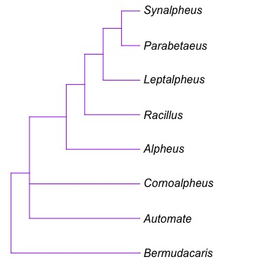

**Phylogenetic Assignment**

`Code to make phylogenetic tree`
```
BekahT<-
  "((Bermudacaris), (Automate, Cornoalpheus, (Alpheus, (Racillus, (Leptalpheus, (Parabetaeus, Synalpheus))))));"
Bekahwow<-read.tree(text=BekahT)
plotTree(Bekahwow,ftype="reg")
```

`Change color of the tree`
```
plot(Bekahwow, edge.color = "purple", label.offset = 0.2, type = "phylogram")
```


