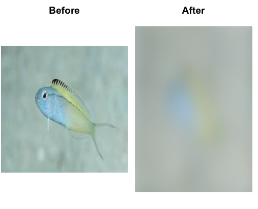
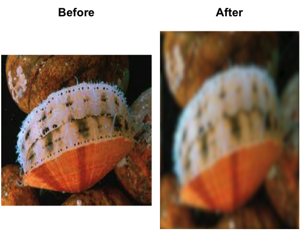

Animal 1
*Crangon septemspinosa* CPD = 0.13

Animal 2

Animal 3

Animal 4
*Aquila audax* CPD = 140

Animal 5 
*Felis catus* CPD = 10

Code:
install.packages("AcuityView")
install.packages("magrittr")
install.packages("imager")
install.packages("fftwtools")
library(AcuityView)
library(fftwtools)
library(imager)
img <- load.image('smallfish.jpeg')
dim(img)
img <- resize(img, 512, 512)
dim(img)
MRA <- 1/0.13
AcuityView(photo = img, distance = 0.5, realWidth = 2, eyeResolutionX = 7.69, eyeResolutionY = NULL, plot = T, output = "firstimage.jpg" )
img2 <- load.image('braincoral.jpeg')
dim(img2)
img2 <- resize(img2, 512, 512)
dim(img2)
MRA <- 1/7.1
AcuityView(photo = img2, distance = 50, realWidth = 4, eyeResolutionX = 0.14, eyeResolutionY = NULL, plot = T, output = "secondimage.jpg" )
img3 <- load.image('scallop.jpeg')
dim(img3)
img3 <- resize(img3, 512, 512)
dim(img3)
MRA <- 1/7.64
AcuityView(photo = img3, distance = 24, realWidth = 0.5, eyeResolutionX = 0.13, eyeResolutionY = NULL, plot = T, output = "thirdimage.jpg" )
img4 <- load.image('fieldmouse.jpeg')
dim(img4)
img4 <- resize(img4, 512, 512)
dim(img4)
MRA <- 1/140
AcuityView(photo = img4, distance = 2160, realWidth = 6, eyeResolutionX = 0.007, eyeResolutionY = NULL, plot = T, output = "fourthimage.jpg" )
img5 <- load.image('cat.jpeg')
dim(img5)
img5 <- resize(img5, 512, 512)
dim(img5)
MRA <- 1/10
AcuityView(photo = img5, distance = 48, realWidth = 6, eyeResolutionX = 0.1, eyeResolutionY = NULL, plot = T, output = "fifthimage.jpg" )
