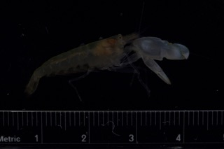

# Educational Experience
Hi, my name is Bekah. I am a masters student at The University of Tulsa. I am currently studying snapping shrimp predominantly the species *Alpheus heterochaelis*. I am using transmission electron microscopy (TEM), microCT, and energy-dispersive X-ray spectroscopy (EDX) to evaluate protective qualities of the orbital hood. 

## Research Interests
[Kingston Lab Website](https://www.kingston-lab.com/)

## Tables

| Date | Description | Assignment Name |
| :-- | :-- | :-- |
| September 1st 2022 | Setup R project and git account | [Assignment 1](Assignments/Assignment1.html) |
| September 8th 2022 | Practice Rmarkdown language | [Assignment 2](index.html) |
| September 15th 2022 | Regular expression challenge | [Assignment 3](Assignments/Assignment3.html) |
| September 26th 2022 | Tidy, merge, and compare data sets, dplyr | [Assignment 4](Assignments/Assignment4.html) |
| September 26th 2022 | Tidy, merge, and compare data sets, tidyr| [Assignment 5](Assignments/Assignment5.html) |
| October 27th 2022 | Visual Acuity | [Visual Acuity Assignment](Assignments/Visual-Acuity-assignment.html) |
| November 16th 2022 | My presentation: Geomorph | [Geomorph assignment](Assignments/Geomorph.html) 
| November 17th 2022 | Phylogenetics Assignment | [Phylogenetics Assignment](Assignments/Phylogenetics-Assignment.html)
| December 1st 2022 | Heatmap Assignment | [Heatmap Assignment](Heatmap_Assignment_.html)

